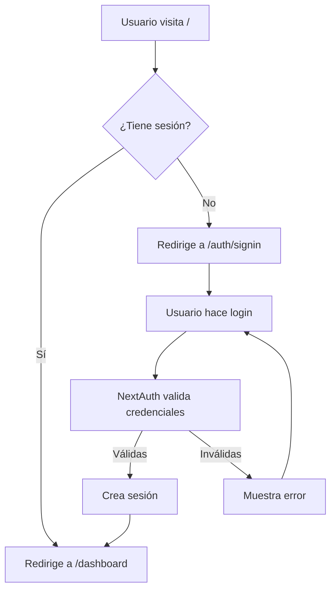

# 📱 Documentación Frontend - EasyPicky

## 📋 Tabla de Contenidos

1. [Estado Actual del Proyecto](#estado-actual-del-proyecto)
2. [Estructura de Archivos](#estructura-de-archivos)
3. [Tecnologías y Librerías](#tecnologías-y-librerías)
4. [Componentes Implementados](#componentes-implementados)
5. [Páginas Implementadas](#páginas-implementadas)
6. [Sistema de Autenticación](#sistema-de-autenticación)
7. [Estilos y Diseño](#estilos-y-diseño)
8. [Roadmap - Próximas Implementaciones](#roadmap---próximas-implementaciones)
9. [Guía de Desarrollo](#guía-de-desarrollo)

---

## 🎯 Estado Actual del Proyecto

### ✅ Completado

- **Sistema de Autenticación**
  - ✅ Registro de usuarios
  - ✅ Login con credenciales
  - ✅ Gestión de sesiones con NextAuth
  - ✅ Protección de rutas
  - ✅ Cierre de sesión
- **Componentes Base UI (shadcn/ui)**
  - ✅ Button
  - ✅ Input
  - ✅ Label
  - ✅ Card (con Header, Content, Footer, etc.)
  - ✅ Alert (con variantes: default, success, warning, destructive, info)
  - ✅ Toast/Toaster (sistema de notificaciones)
  - ✅ Dialog/Modal (con Header, Footer, Content)
  - ✅ Table (con Caption, Header, Body, Row, Cell)
  - ✅ Dropdown Menu (con Label, Separator, Item)
  - ✅ Badge (con variantes: default, secondary, destructive, outline, success, warning, info)
- **Páginas**

  - ✅ Landing page con redirección automática
  - ✅ Página de registro (`/auth/signup`)
  - ✅ Página de login (`/auth/signin`)
  - ✅ Dashboard básico (`/dashboard`)
  - ✅ Página de demostración de componentes (`/components-example`)

- **Infraestructura**

  - ✅ Tailwind CSS v3.4.1 configurado
  - ✅ TypeScript configurado
  - ✅ React Hook Form + Zod para formularios
  - ✅ NextAuth integrado con Prisma
  - ✅ PostCSS y Autoprefixer configurados

  - **Gestión de Clubes**
  - ✅ Listado de clubes con búsqueda y filtros
  - ✅ Creación de clubes
  - ✅ Detalle de club
  - ✅ Edición de club (creador/admin)
  - ✅ Eliminación de club (creador/admin)
  - ✅ Gestión de miembros (agregar, actualizar estado, eliminar)
  - ✅ Sistema de autenticación con JWT para API

### 🚧 En Desarrollo

- Funcionalidades del dashboard con datos reales
- Integración completa con API backend

### ❌ Pendiente

Ver sección [Roadmap](#roadmap---próximas-implementaciones)

---

## 📁 Estructura de Archivos

```
easy-picky/
├── src/
│   ├── app/
│   │   ├── layout.tsx                 # Layout raíz con AuthProvider
│   │   ├── page.tsx                   # Landing page (redirige)
│   │   ├── globals.css                # Estilos globales + variables CSS
│   │   ├── auth/
│   │   │   ├── signin/
│   │   │   │   └── page.tsx          # Página de login
│   │   │   └── signup/
│   │   │       └── page.tsx          # Página de registro
│   │   ├── dashboard/
│   │   │   └── page.tsx              # Dashboard principal
│   │   ├── components-example/
│   │   │   └── page.tsx              # Demo de componentes UI
│   │   └── clubs/
│   │       ├── page.tsx                    # Listado de clubes
│   │       ├── new/
│   │       │   └── page.tsx               # Crear club
│   │       └── [id]/
│   │           ├── page.tsx               # Detalle de club
│   │           ├── edit/
│   │           │   └── page.tsx           # Editar club
│   │           └── members/
│   │               └── page.tsx           # Gestionar miembros
│   │
│   ├── components/
│   │   ├── auth/
│   │   │   ├── LoginForm.tsx         # Formulario de login
│   │   │   └── RegisterForm.tsx      # Formulario de registro
│   │   │
│   │   ├── providers/
│   │   │   └── AuthProvider.tsx      # Provider de NextAuth
│   │   │
│   │   └── ui/                       # Componentes base (shadcn/ui)
│   │       ├── button.tsx
│   │       ├── input.tsx
│   │       ├── label.tsx
│   │       ├── card.tsx
│   │       ├── alert.tsx
│   │       ├── toast.tsx
│   │       ├── toaster.tsx
│   │       ├── use-toast.ts
│   │       ├── dialog.tsx
│   │       ├── table.tsx
│   │       ├── dropdown-menu.tsx
│   │       └── badge.tsx
│   │
│   ├── lib/
│   │   ├── api.ts                    # Helper para peticiones API con JWT
│   │   ├── auth.ts                   # Configuración NextAuth
│   │   ├── auth-middleware.ts        # Middleware autenticación API
│   │   ├── prisma.ts                 # Cliente Prisma
│   │   └── utils.ts                  # Utilidades (cn función)
│   │
│   └── types/
│       ├── club.ts                        # Tipos TypeScript para clubes
│       └── next-auth.d.ts            # Types de NextAuth extendidos
│
├── prisma/
│   └── schema.prisma                 # Schema de base de datos
│
├── tailwind.config.js                # Config Tailwind CSS v3
├── postcss.config.mjs                # Config PostCSS
├── tsconfig.json                     # Config TypeScript
└── package.json                      # Dependencias
```

---

## 🛠️ Tecnologías y Librerías

### Core

| Tecnología       | Versión | Propósito                      |
| ---------------- | ------- | ------------------------------ |
| **Next.js**      | 15.5.6  | Framework React con App Router |
| **React**        | 19.1.0  | Librería UI                    |
| **TypeScript**   | 5.x     | Type safety                    |
| **Tailwind CSS** | 3.4.1   | Estilos utility-first          |
| **PostCSS**      | 8.4.35  | Transformación de CSS          |
| **Autoprefixer** | 10.4.17 | Prefijos CSS automáticos       |

### Autenticación

| Librería         | Versión | Propósito              |
| ---------------- | ------- | ---------------------- |
| **NextAuth.js**  | 4.24.11 | Autenticación completa |
| **bcryptjs**     | 3.0.2   | Hash de contraseñas    |
| **jsonwebtoken** | 9.0.2   | JWT tokens para API    |

### Formularios y Validación

| Librería                | Versión | Propósito              |
| ----------------------- | ------- | ---------------------- |
| **React Hook Form**     | 7.65.0  | Gestión de formularios |
| **Zod**                 | 4.0.14  | Validación de schemas  |
| **@hookform/resolvers** | 5.2.2   | Integración Zod + RHF  |

### UI Components (shadcn/ui)

| Librería                          | Versión | Propósito                  |
| --------------------------------- | ------- | -------------------------- |
| **@radix-ui/react-label**         | 2.1.7   | Componente Label accesible |
| **@radix-ui/react-slot**          | 1.2.3   | Composición de componentes |
| **@radix-ui/react-dialog**        | 1.1.15  | Componente Dialog/Modal    |
| **@radix-ui/react-dropdown-menu** | 2.1.16  | Dropdown Menu accesible    |
| **class-variance-authority**      | 0.7.1   | Variantes de componentes   |
| **clsx**                          | 2.1.1   | Clases condicionales       |
| **tailwind-merge**                | 3.3.1   | Merge de clases Tailwind   |

### Base de Datos

| Librería                      | Versión | Propósito               |
| ----------------------------- | ------- | ----------------------- |
| **Prisma**                    | 6.13.0  | ORM                     |
| **@prisma/client**            | 6.13.0  | Cliente Prisma          |
| **@next-auth/prisma-adapter** | 1.0.7   | Adapter NextAuth-Prisma |

---

## 🧩 Componentes Implementados

### 1. Componentes UI Base (`src/components/ui/`)

#### Button (`button.tsx`)

Botón reutilizable con múltiples variantes y tamaños.

**Variantes:**

- `default` - Botón primario
- `destructive` - Botón de acción destructiva (eliminar, etc.)
- `outline` - Botón con borde
- `secondary` - Botón secundario
- `ghost` - Botón sin fondo
- `link` - Estilo de enlace

**Tamaños:**

- `default` - Tamaño estándar
- `sm` - Pequeño
- `lg` - Grande
- `icon` - Para iconos (cuadrado)

**Uso:**

```tsx
import { Button } from "@/components/ui/button";

<Button>Click me</Button>
<Button variant="outline" size="lg">Large Outline</Button>
<Button variant="destructive">Delete</Button>
```

#### Input (`input.tsx`)

Campo de entrada con estilos consistentes y estados (focus, disabled, error).

**Uso:**

```tsx
import { Input } from "@/components/ui/input";

<Input type="email" placeholder="email@example.com" />
<Input type="password" disabled />
```

#### Label (`label.tsx`)

Etiqueta accesible para formularios (usa Radix UI).

**Uso:**

```tsx
import { Label } from "@/components/ui/label";

<Label htmlFor="email">Email</Label>
<Input id="email" type="email" />
```

#### Card (`card.tsx`)

Contenedor con múltiples subcomponentes para layouts.

**Subcomponentes:**

- `Card` - Contenedor principal
- `CardHeader` - Cabecera
- `CardTitle` - Título
- `CardDescription` - Descripción
- `CardContent` - Contenido principal
- `CardFooter` - Pie de card

**Uso:**

```tsx
import {
  Card,
  CardContent,
  CardDescription,
  CardHeader,
  CardTitle,
} from "@/components/ui/card";

<Card>
  <CardHeader>
    <CardTitle>Title</CardTitle>
    <CardDescription>Description</CardDescription>
  </CardHeader>
  <CardContent>Content here</CardContent>
</Card>;
```

#### Alert (`alert.tsx`)

Mensajes de alerta estáticos para mostrar información importante en la página.

**Variantes:**

- `default` - Alerta por defecto (azul/gris)
- `success` - Alerta de éxito (verde)
- `warning` - Alerta de advertencia (amarillo)
- `destructive` - Alerta de error (rojo)
- `info` - Alerta informativa (azul)

**Subcomponentes:**

- `Alert` - Contenedor principal
- `AlertTitle` - Título de la alerta
- `AlertDescription` - Descripción de la alerta

**Uso:**

```tsx
import { Alert, AlertDescription, AlertTitle } from "@/components/ui/alert";

<Alert variant="success">
  <AlertTitle>¡Éxito!</AlertTitle>
  <AlertDescription>Tu operación se completó exitosamente.</AlertDescription>
</Alert>;
```

#### Toast / Toaster (`toast.tsx`, `toaster.tsx`, `use-toast.ts`)

Sistema de notificaciones temporales que aparecen en la esquina de la pantalla.

**Variantes:**

- `success` - Notificación de éxito
- `destructive` - Notificación de error
- `warning` - Notificación de advertencia
- `info` - Notificación informativa

**Uso:**

```tsx
import { useToast } from "@/components/ui/use-toast";

function MyComponent() {
  const { addToast } = useToast();

  return (
    <Button
      onClick={() =>
        addToast({
          title: "Éxito",
          description: "La operación se completó correctamente",
          variant: "success",
        })
      }
    >
      Mostrar Toast
    </Button>
  );
}

// En layout.tsx o componente raíz
import { Toaster } from "@/components/ui/toaster";
<Toaster />;
```

#### Dialog (`dialog.tsx`)

Ventanas modales para confirmaciones, formularios y contenido adicional.

**Subcomponentes:**

- `Dialog` - Contenedor principal
- `DialogTrigger` - Botón/elemento que abre el diálogo
- `DialogContent` - Contenido del diálogo
- `DialogHeader` - Cabecera del diálogo
- `DialogTitle` - Título del diálogo
- `DialogDescription` - Descripción del diálogo
- `DialogFooter` - Pie del diálogo (para botones de acción)

**Uso:**

```tsx
import {
  Dialog,
  DialogContent,
  DialogDescription,
  DialogFooter,
  DialogHeader,
  DialogTitle,
  DialogTrigger,
} from "@/components/ui/dialog";

<Dialog>
  <DialogTrigger asChild>
    <Button>Abrir Modal</Button>
  </DialogTrigger>
  <DialogContent>
    <DialogHeader>
      <DialogTitle>¿Estás seguro?</DialogTitle>
      <DialogDescription>Esta acción no se puede deshacer.</DialogDescription>
    </DialogHeader>
    <DialogFooter>
      <Button variant="outline">Cancelar</Button>
      <Button variant="destructive">Confirmar</Button>
    </DialogFooter>
  </DialogContent>
</Dialog>;
```

#### Table (`table.tsx`)

Componente para mostrar datos tabulares estructurados.

**Subcomponentes:**

- `Table` - Contenedor principal de la tabla
- `TableCaption` - Título/descripción de la tabla
- `TableHeader` - Cabecera de la tabla
- `TableBody` - Cuerpo de la tabla
- `TableFooter` - Pie de la tabla
- `TableRow` - Fila de la tabla
- `TableHead` - Celda de cabecera
- `TableCell` - Celda de datos

**Uso:**

```tsx
import {
  Table,
  TableBody,
  TableCaption,
  TableCell,
  TableHead,
  TableHeader,
  TableRow,
} from "@/components/ui/table";

<Table>
  <TableCaption>Lista de usuarios</TableCaption>
  <TableHeader>
    <TableRow>
      <TableHead>Nombre</TableHead>
      <TableHead>Email</TableHead>
    </TableRow>
  </TableHeader>
  <TableBody>
    <TableRow>
      <TableCell>Juan Pérez</TableCell>
      <TableCell>juan@test.com</TableCell>
    </TableRow>
  </TableBody>
</Table>;
```

#### Dropdown Menu (`dropdown-menu.tsx`)

Menús desplegables para acciones y navegación.

**Subcomponentes:**

- `DropdownMenu` - Contenedor principal
- `DropdownMenuTrigger` - Botón que abre el menú
- `DropdownMenuContent` - Contenido del menú
- `DropdownMenuLabel` - Etiqueta/título dentro del menú
- `DropdownMenuItem` - Item individual del menú
- `DropdownMenuSeparator` - Separador visual

**Uso:**

```tsx
import {
  DropdownMenu,
  DropdownMenuContent,
  DropdownMenuItem,
  DropdownMenuLabel,
  DropdownMenuSeparator,
  DropdownMenuTrigger,
} from "@/components/ui/dropdown-menu";

<DropdownMenu>
  <DropdownMenuTrigger asChild>
    <Button variant="outline">Abrir Menú</Button>
  </DropdownMenuTrigger>
  <DropdownMenuContent>
    <DropdownMenuLabel>Mi Cuenta</DropdownMenuLabel>
    <DropdownMenuSeparator />
    <DropdownMenuItem>Perfil</DropdownMenuItem>
    <DropdownMenuItem>Configuración</DropdownMenuItem>
    <DropdownMenuSeparator />
    <DropdownMenuItem className="text-red-600">Cerrar Sesión</DropdownMenuItem>
  </DropdownMenuContent>
</DropdownMenu>;
```

#### Badge (`badge.tsx`)

Etiquetas pequeñas para mostrar estados, categorías o información adicional.

**Variantes:**

- `default` - Badge por defecto
- `secondary` - Badge secundario
- `destructive` - Badge de error/eliminación
- `outline` - Badge con borde
- `success` - Badge de éxito (verde)
- `warning` - Badge de advertencia (amarillo)
- `info` - Badge informativo (azul)

**Uso:**

```tsx
import { Badge } from "@/components/ui/badge";

<Badge>Default</Badge>
<Badge variant="success">Activo</Badge>
<Badge variant="destructive">Error</Badge>
<Badge variant="outline">Pendiente</Badge>
```

---

### 2. Componentes de Autenticación (`src/components/auth/`)

#### LoginForm (`LoginForm.tsx`)

Formulario de inicio de sesión con validación.

**Características:**

- Validación con Zod
- Estados de carga
- Manejo de errores
- Integración con NextAuth

**Campos:**

- Email (requerido, validado)
- Password (requerido, mínimo 6 caracteres)

**Flujo:**

1. Usuario completa formulario
2. Validación en cliente
3. Llamada a `signIn("credentials")`
4. Redirección a `/dashboard` si éxito
5. Muestra error si falla

#### RegisterForm (`RegisterForm.tsx`)

Formulario de registro de nuevos usuarios.

**Características:**

- Validación con Zod
- Estados de carga
- Manejo de errores
- Llamada a API de registro

**Campos:**

- Name (requerido, mínimo 2 caracteres)
- Email (requerido, validado)
- Password (requerido, mínimo 6 caracteres)
- Phone (opcional)
- City (opcional)

**Flujo:**

1. Usuario completa formulario
2. Validación en cliente
3. POST a `/api/auth/register`
4. Redirección a `/auth/signin` si éxito
5. Muestra error si falla

---

### 3. Providers (`src/components/providers/`)

#### AuthProvider (`AuthProvider.tsx`)

Wrapper de `SessionProvider` de NextAuth para toda la app.

**Propósito:**

- Provee contexto de sesión a toda la aplicación
- Debe envolver el contenido en el layout raíz

**Uso:**

```tsx
// En layout.tsx
<AuthProvider>{children}</AuthProvider>
```

---

### 4. Componentes de Clubes (`src/components/clubs/`)

#### ClubForm (`ClubForm.tsx`)

Formulario reutilizable para crear y editar clubes.

**Características:**

- Validación con Zod
- Modo crear/editar
- Estados de carga
- Manejo de errores
- Integración con API

**Campos:**

- Name (requerido, max 100 caracteres)
- Description (opcional)
- Address (requerido)
- City (requerido)
- Phone (opcional)
- Email (opcional, validado)
- Website (opcional, validado como URL)
- Logo (opcional, validado como URL)

**Modos:**

- `create` - Crear nuevo club
- `edit` - Editar club existente

**Uso:**

```tsx
import { ClubForm } from "@/components/clubs/ClubForm";

// Crear
<ClubForm mode="create" />

// Editar
<ClubForm mode="edit" club={clubData} />
```

#### ClubCard (`ClubCard.tsx`)

Tarjeta de club para mostrar en listados.

**Características:**

- Muestra información resumida del club
- Logo si está disponible
- Badges con estadísticas (miembros, pistas, eventos)
- Botón para ver detalles

**Props:**

- `club` - Objeto Club con información completa

**Uso:**

```tsx
import { ClubCard } from "@/components/clubs/ClubCard";

<ClubCard club={clubData} />;
```

---

## 📄 Páginas Implementadas

### 1. Landing Page (`src/app/page.tsx`)

**Ruta:** `/`

**Funcionalidad:**

- Verifica estado de autenticación
- Redirige a `/dashboard` si hay sesión activa
- Redirige a `/auth/signin` si no hay sesión

**Estado:** ✅ Implementada

---

### 2. Página de Login (`src/app/auth/signin/page.tsx`)

**Ruta:** `/auth/signin`

**Componentes:**

- `LoginForm` - Formulario principal
- `Card` - Contenedor
- Link a página de registro

**Funcionalidad:**

- Login con email/password
- Validación de campos
- Manejo de errores
- Redirección tras login exitoso

**Estado:** ✅ Implementada

---

### 3. Página de Registro (`src/app/auth/signup/page.tsx`)

**Ruta:** `/auth/signup`

**Componentes:**

- `RegisterForm` - Formulario principal
- `Card` - Contenedor
- Link a página de login

**Funcionalidad:**

- Registro de nuevos usuarios
- Campos opcionales (phone, city)
- Validación de campos
- Prevención de emails duplicados
- Redirección tras registro exitoso

**Estado:** ✅ Implementada

---

### 4. Dashboard (`src/app/dashboard/page.tsx`)

**Ruta:** `/dashboard`

**Protección:** ⚠️ Requiere autenticación

**Secciones:**

1. **Header**

   - Logo y título de la app
   - Botón de cerrar sesión

2. **Welcome Section**

   - Saludo personalizado con nombre de usuario
   - Información de email y rol

3. **Stats Cards** (datos estáticos por ahora)

   - Clubes disponibles
   - Próximos eventos
   - Membresías activas
   - Partidos jugados

4. **Acciones Rápidas** (deshabilitadas - futuro)

   - Buscar Clubes
   - Ver Eventos
   - Mis Partidos

5. **Actividad Reciente**
   - Placeholder vacío

**Estado:** ✅ Implementada (básica, sin datos reales)

**Pendiente:**

- Integración con API para datos reales
- Gráficos de estadísticas
- Lista de eventos próximos
- Acciones rápidas funcionales

---

### 5. Página de Demostración de Componentes (`src/app/components-example/page.tsx`)

**Ruta:** `/components-example`

**Protección:** ❌ No requiere autenticación

**Secciones:**

1. **Toast / Notificaciones** - Ejemplos de todos los tipos de toast
2. **Alerts** - Ejemplos de todas las variantes de alert
3. **Dialog / Modal** - Ejemplos de modales de confirmación y formularios
4. **Table** - Tabla con datos de ejemplo
5. **Dropdown Menu** - Menús desplegables con acciones
6. **Badges** - Todas las variantes de badges
7. **Buttons** - Todas las variantes y tamaños de botones

**Propósito:**

- Documentación visual de componentes
- Testing de componentes UI
- Referencia para desarrolladores

**Estado:** ✅ Implementada

---

### 6. Página de Listado de Clubes (`src/app/clubs/page.tsx`)

**Ruta:** `/clubs`

**Protección:** ❌ No requiere autenticación (acceso público)

**Funcionalidades:**

- Listado paginado de clubes (12 por página)
- Búsqueda por nombre/descripción
- Filtro por ciudad
- Cards informativos con estadísticas
- Botón "Crear Club" (requiere autenticación)

**Estado:** ✅ Implementada

---

### 7. Página de Creación de Club (`src/app/clubs/new/page.tsx`)

**Ruta:** `/clubs/new`

**Protección:** ⚠️ Requiere autenticación

**Funcionalidades:**

- Formulario completo de creación
- Validación de campos
- Campos opcionales claramente marcados
- Redirección automática al detalle tras creación

**Estado:** ✅ Implementada

---

### 8. Página de Detalle de Club (`src/app/clubs/[id]/page.tsx`)

**Ruta:** `/clubs/[id]`

**Protección:** ❌ No requiere autenticación (acceso público)

**Secciones:**

1. **Información Principal**

   - Nombre, ciudad, logo
   - Descripción
   - Badges con estadísticas

2. **Información de Contacto**

   - Dirección
   - Teléfono (si existe)
   - Email (si existe)
   - Website (si existe)

3. **Información del Creador**
   - Nombre
   - Email
   - Fecha de creación

**Acciones (solo creador/admin):**

- Editar información
- Gestionar miembros
- Eliminar club (con confirmación)

**Estado:** ✅ Implementada

---

### 9. Página de Edición de Club (`src/app/clubs/[id]/edit/page.tsx`)

**Ruta:** `/clubs/[id]/edit`

**Protección:** ⚠️ Requiere autenticación y permisos (creador/SUPER_ADMIN)

**Funcionalidades:**

- Formulario pre-cargado con datos actuales
- Validación de permisos
- Actualización parcial de campos
- Redirección al detalle tras guardar

**Estado:** ✅ Implementada

---

### 10. Página de Gestión de Miembros (`src/app/clubs/[id]/members/page.tsx`)

**Ruta:** `/clubs/[id]/members`

**Protección:** ⚠️ Requiere autenticación y permisos (creador/SUPER_ADMIN)

**Funcionalidades:**

- Tabla completa de miembros
- Información detallada (nombre, email, ciudad, DUPR rating)
- Estados de membresía con badges
- Agregar miembros (por ID de usuario)
- Cambiar estado de membresía (ACTIVE, INACTIVE, PENDING, CANCELLED)
- Eliminar miembros (con confirmación)
- Dropdown menu de acciones por miembro

**Estado:** ✅ Implementada

**Pendiente:**

- Búsqueda de usuarios por email/nombre (ahora se usa ID)
- Filtros avanzados
- Exportación de lista

---

## 🔐 Sistema de Autenticación

### Flujo de Autenticación



### Tecnologías Usadas

**NextAuth.js:**

- Gestión de sesiones
- Múltiples providers (actualmente: credentials)
- JWT para tokens
- Cookies seguras

**Backend:**

- Prisma para acceso a BD
- bcryptjs para hash de contraseñas
- Validación con Zod

### Configuración

**Archivo:** `src/lib/auth.ts`

**Providers configurados:**

- ✅ Credentials (email + password)
- ⏳ Google OAuth (preparado, no usado aún)

**Estrategia de sesión:** JWT

**Callbacks:**

- `jwt`: Agrega `role` e `id` al token
- `session`: Expone `role` e `id` en la sesión del cliente

### Protección de Rutas

**Cliente (React):**

```tsx
"use client";

import { useSession } from "next-auth/react";
import { useRouter } from "next/navigation";
import { useEffect } from "react";

export default function ProtectedPage() {
  const { data: session, status } = useSession();
  const router = useRouter();

  useEffect(() => {
    if (status === "unauthenticated") {
      router.push("/auth/signin");
    }
  }, [status, router]);

  if (status === "loading") return <p>Cargando...</p>;
  if (!session) return null;

  return <div>Contenido protegido</div>;
}
```

**Servidor (API Routes):**

```typescript
// src/lib/auth-middleware.ts
export async function verifyToken(request: NextRequest) {
  // Extrae y verifica JWT del header Authorization
}

export function withAuth(handler) {
  // Wrapper para proteger rutas de API
}

export function withRole(roles, handler) {
  // Wrapper para verificar roles específicos
}
```

### Sesiones

**Almacenamiento:**

- Tabla `sessions` en PostgreSQL
- Token en cookie HTTP-only

**Expiración:**

- Sesiones expiran según configuración de NextAuth
- Tokens JWT tienen expiración independiente

---

## 🔌 Sistema de API

### Helper de API (`src/lib/api.ts`)

Utilidad para hacer peticiones autenticadas a la API.

**Características:**

- Obtención automática de JWT token desde sesión NextAuth
- Cache de token (6 días)
- Manejo de errores con clase `ApiError`
- Soporte para métodos HTTP: GET, POST, PUT, DELETE

**Flujo de Autenticación:**

1. Verifica sesión activa de NextAuth
2. Obtiene JWT token desde `/api/auth/token`
3. Cachea el token
4. Agrega token en header `Authorization: Bearer <token>`
5. Backend valida token con middleware `withAuth`

**Uso:**

```typescript
import { api } from "@/lib/api";

// GET request
const data = await api.get("/clubs");

// POST request
const response = await api.post("/clubs", {
  name: "Mi Club",
  city: "Madrid",
});

// PUT request
await api.put("/clubs/123", { name: "Nuevo Nombre" });

// DELETE request
await api.delete("/clubs/123");

// Request sin autenticación
const data = await api.get("/clubs", { requiresAuth: false });
```

**Manejo de Errores:**

```typescript
try {
  await api.post("/clubs", data);
} catch (error) {
  if (error instanceof ApiError) {
    console.log(error.status); // 401, 403, etc.
    console.log(error.message); // Mensaje del error
  }
}
```

**Limpiar Cache (al hacer logout):**

```typescript
import { clearAuthTokenCache } from "@/lib/api";

clearAuthTokenCache();
await signOut();
```

### Endpoint de Token (`/api/auth/token`)

Convierte sesión de NextAuth en JWT token para autenticación de API.

**Funcionalidad:**

- Verifica sesión activa de NextAuth
- Genera JWT token firmado con `NEXTAUTH_SECRET`
- Token expira en 7 días
- Solo accesible con sesión válida

**Response:**

```json
{
  "token": "eyJhbGciOiJIUzI1NiIsInR5cCI6IkpXVCJ9..."
}
```

### Tipos de Club (`src/types/club.ts`)

Definiciones TypeScript para trabajar con clubes.

**Interfaces principales:**

- `Club` - Información completa del club
- `ClubMembership` - Datos de membresía
- `CreateClubData` - Datos para crear club
- `UpdateClubData` - Datos para actualizar club
- `AddMemberData` - Datos para agregar miembro
- `UpdateMembershipData` - Datos para actualizar membresía
- `ClubsResponse` - Respuesta del listado con paginación
- `MembersResponse` - Respuesta del listado de miembros

---

## 🎨 Estilos y Diseño

### Tailwind CSS v3

**Versión:** 3.4.1

**Archivo de configuración:** `tailwind.config.js`

**Características:**

- Utility-first CSS
- Purge automático de clases no usadas
- Personalización mediante variables CSS
- Soporte para dark mode
- `@apply`, `@layer` y directivas de Tailwind

### Sistema de Colores (shadcn/ui)

Definidos en `src/app/globals.css`:

```css
:root {
  --background: 210 40% 96.1%; /* Fondo gris claro */
  --foreground: 222.2 84% 4.9%; /* Texto oscuro */
  --primary: 222.2 47.4% 11.2%; /* Color primario */
  --secondary: 210 40% 96.1%; /* Color secundario */
  --muted: 210 40% 96.1%; /* Color apagado */
  --accent: 210 40% 96.1%; /* Color de acento */
  --destructive: 0 84.2% 60.2%; /* Color de error */
  --border: 214.3 31.8% 91.4%; /* Color de bordes */
  --input: 214.3 31.8% 91.4%; /* Color de inputs */
  --ring: 222.2 84% 4.9%; /* Color de focus ring */
}
```

**Dark Mode:**

- Variables CSS preparadas en `.dark` class
- Cambio con clase `.dark` en `<html>`
- Configurado con `darkMode: ["class"]` en tailwind.config.js

### Responsive Design

**Breakpoints de Tailwind:**

- `sm`: 640px
- `md`: 768px
- `lg`: 1024px
- `xl`: 1280px
- `2xl`: 1536px

**Ejemplos usados:**

```tsx
<div className="grid grid-cols-1 md:grid-cols-2 lg:grid-cols-4 gap-6">
  {/* Responsive grid */}
</div>
```

### Utilidades

**Función `cn` (`src/lib/utils.ts`):**

```typescript
import { clsx } from "clsx";
import { twMerge } from "tailwind-merge";

export function cn(...inputs) {
  return twMerge(clsx(inputs));
}
```

**Propósito:**

- Combina clases de Tailwind sin conflictos
- Permite clases condicionales

**Uso:**

```tsx
<div
  className={cn("base-class", condition && "conditional-class", className)}
/>
```

---

## 🗺️ Roadmap - Próximas Implementaciones

### Fase 1: Componentes UI Base Restantes (1 semana)

#### Alta Prioridad

- [x] **Alert** - Mensajes de alerta estáticos ✅
- [x] **Toast** - Notificaciones temporales ✅
- [x] **Dialog/Modal** - Ventanas modales ✅
- [x] **Dropdown Menu** - Menús desplegables ✅
- [x] **Table** - Tablas de datos ✅
- [x] **Badge** - Etiquetas de estado ✅
- [ ] **Avatar** - Fotos de perfil
- [ ] **Skeleton** - Loading placeholders

#### Media Prioridad

- [ ] **Tabs** - Navegación entre secciones
- [ ] **Select** - Campos de selección
- [ ] **Checkbox/Radio** - Opciones múltiples
- [ ] **Switch** - Toggle on/off
- [ ] **Textarea** - Campos de texto largo
- [ ] **Progress** - Barras de progreso

#### Baja Prioridad

- [ ] **Accordion** - Secciones colapsables
- [ ] **Tooltip** - Información al hover
- [ ] **Popover** - Contenido emergente
- [ ] **Calendar** - Selector de fechas
- [ ] **Command** - Command palette

---

### Fase 2: Gestión de Perfil (1 semana)

- [ ] **Página de Perfil** (`/profile`)

  - [ ] Ver información del usuario
  - [ ] Editar nombre, teléfono, ciudad
  - [ ] Cambiar contraseña
  - [ ] Subir avatar
  - [ ] Conectar DUPR ID

- [ ] **Formularios**
  - [ ] Formulario de edición de perfil
  - [ ] Formulario de cambio de contraseña
  - [ ] Validación de campos

---

### Fase 3: Gestión de Clubes (2-3 semanas) - ✅ EN PROGRESO

#### Vista Usuario Regular

- [x] **Explorar Clubes** (`/clubs`) ✅

  - [x] Lista de clubes disponibles
  - [x] Búsqueda por nombre
  - [x] Filtros (ciudad)
  - [x] Paginación

- [x] **Detalle de Club** (`/clubs/[id]`) ✅

  - [x] Información del club
  - [x] Información de contacto
  - [x] Información del creador
  - [x] Estadísticas (miembros, pistas, eventos)
  - [ ] Lista de pistas
  - [ ] Próximos eventos
  - [ ] Botón "Unirse"

- [ ] **Mis Clubes** (`/my-clubs`)
  - [ ] Lista de clubes donde soy miembro
  - [ ] Estado de membresía
  - [ ] Acciones rápidas

#### Vista Creador de Club

- [x] **Crear Club** (`/clubs/new`) ✅

  - [x] Formulario de creación
  - [x] Validación completa
  - [ ] Subir logo (por ahora URL)

- [x] **Editar Club** (`/clubs/[id]/edit`) ✅

  - [x] Formulario de edición
  - [x] Pre-carga de datos
  - [x] Validación de permisos

- [x] **Gestionar Miembros** (`/clubs/[id]/members`) ✅

  - [x] Lista de miembros
  - [x] Agregar miembros (por ID)
  - [x] Cambiar estados de membresía
  - [x] Eliminar miembros
  - [ ] Búsqueda de usuarios por email/nombre
  - [ ] Filtros avanzados

- [x] **Eliminar Club** ✅

  - [x] Modal de confirmación
  - [x] Validación de permisos
  - [x] Eliminación en cascada

- [ ] **Dashboard del Club** (`/clubs/[id]/manage`)

  - [ ] Estadísticas del club
  - [ ] Gráficos de actividad
  - [ ] Accesos rápidos

- [ ] **Pistas** (`/clubs/[id]/courts`)
  - [ ] Lista de pistas
  - [ ] Crear/editar/eliminar pistas
  - [ ] Activar/desactivar

---

### Fase 4: Gestión de Eventos (2-3 semanas)

#### Vista Usuario Regular

- [ ] **Explorar Eventos** (`/events`)

  - [ ] Lista de eventos disponibles
  - [ ] Filtros (tipo, ciudad, fecha)
  - [ ] Búsqueda
  - [ ] Calendario de eventos

- [ ] **Eventos Cercanos** (`/events/nearby`)

  - [ ] Eventos en mi ciudad
  - [ ] Próximos 7 días
  - [ ] Filtros específicos

- [ ] **Detalle de Evento** (`/events/[id]`)

  - [ ] Información completa
  - [ ] Participantes inscritos
  - [ ] Botón "Inscribirse"
  - [ ] Compartir evento

- [ ] **Mis Eventos** (`/my-events`)
  - [ ] Eventos donde estoy inscrito
  - [ ] Próximos y pasados
  - [ ] Check-in QR code

#### Vista Creador de Club

- [ ] **Crear Evento** (`/events/new`)

  - [ ] Formulario completo
  - [ ] Selección de pista
  - [ ] Configuración de visibilidad
  - [ ] Precio (si aplica)

- [ ] **Gestionar Evento** (`/events/[id]/manage`)

  - [ ] Editar información
  - [ ] Ver participantes
  - [ ] Hacer check-in manual
  - [ ] Cambiar estado
  - [ ] Cancelar evento

- [ ] **Participantes** (`/events/[id]/participants`)
  - [ ] Lista completa
  - [ ] Estados de check-in
  - [ ] Estadísticas
  - [ ] Exportar lista

---

### Fase 5: Gestión de Partidos (2 semanas)

#### Partidos Informales

- [ ] **Registrar Partido** (`/matches/new`)

  - [ ] Formulario de creación
  - [ ] Selección de participantes
  - [ ] Ingresar resultado
  - [ ] Singles o Doubles

- [ ] **Mis Partidos** (`/my-matches`)

  - [ ] Historial completo
  - [ ] Filtros (tipo, fecha)
  - [ ] Estadísticas personales
  - [ ] Win rate

- [ ] **Detalle de Partido** (`/matches/[id]`)
  - [ ] Información completa
  - [ ] Participantes y equipos
  - [ ] Resultado
  - [ ] Editar/eliminar (si soy creador)

#### Partidos de Club

- [ ] **Partidos del Club** (`/clubs/[id]/matches`)

  - [ ] Lista de partidos
  - [ ] Filtros (pista, fecha, tipo)
  - [ ] Estadísticas del club

- [ ] **Crear Partido de Club** (`/clubs/[id]/matches/new`)
  - [ ] Selección de pista obligatoria
  - [ ] Solo miembros activos
  - [ ] Vincular a evento (opcional)

---

### Fase 6: Estadísticas y Analytics (1-2 semanas)

- [ ] **Dashboard de Estadísticas** (`/stats`)

  - [ ] Gráficos de partidos ganados/perdidos
  - [ ] Win rate por tipo de partido
  - [ ] Evolución temporal
  - [ ] Comparación con otros jugadores

- [ ] **Estadísticas del Club** (`/clubs/[id]/stats`)

  - [ ] Miembros activos
  - [ ] Eventos realizados
  - [ ] Partidos jugados
  - [ ] Asistencia promedio

- [ ] **Ranking** (`/rankings`)
  - [ ] Ranking global
  - [ ] Ranking por ciudad
  - [ ] Filtros (nivel DUPR)

---

### Fase 7: Administración (1 semana)

#### Solo SUPER_ADMIN

- [ ] **Panel de Administración** (`/admin`)

  - [ ] Métricas de la plataforma
  - [ ] Usuarios totales
  - [ ] Clubes activos
  - [ ] Eventos recientes

- [ ] **Gestión de Usuarios** (`/admin/users`)

  - [ ] Lista completa de usuarios
  - [ ] Búsqueda y filtros
  - [ ] Ver detalles
  - [ ] Eliminar usuarios

- [ ] **Gestión de Clubes** (`/admin/clubs`)

  - [ ] Lista de todos los clubes
  - [ ] Editar/eliminar clubes
  - [ ] Verificar información

- [ ] **Logs y Auditoría** (`/admin/logs`)
  - [ ] Actividad reciente
  - [ ] Errores
  - [ ] Acciones administrativas

---

### Fase 8: Pagos (Stripe) (2-3 semanas)

- [ ] **Configuración Stripe**

  - [ ] Stripe Connect para clubes
  - [ ] Webhooks
  - [ ] Testing mode

- [ ] **Eventos de Pago**

  - [ ] Checkout flow
  - [ ] Confirmación de pago
  - [ ] Recibos

- [ ] **Suscripciones de Clubes**

  - [ ] Suscripción mensual
  - [ ] Portal de gestión
  - [ ] Cancelación

- [ ] **Historial de Pagos**
  - [ ] Ver mis pagos
  - [ ] Descargar recibos
  - [ ] Reembolsos

---

### Fase 9: Features Adicionales (Continuo)

- [ ] **Notificaciones**

  - [ ] Sistema de notificaciones en tiempo real
  - [ ] Email notifications
  - [ ] Push notifications (PWA)

- [ ] **Chat/Mensajería**

  - [ ] Mensajes entre usuarios
  - [ ] Chat de eventos
  - [ ] Notificaciones

- [ ] **Búsqueda Avanzada**

  - [ ] Búsqueda global
  - [ ] Filtros complejos
  - [ ] Autocompletado

- [ ] **PWA**

  - [ ] Installable app
  - [ ] Offline mode
  - [ ] Push notifications

- [ ] **Dark Mode**

  - [ ] Toggle en UI
  - [ ] Persistencia de preferencia

- [ ] **Internacionalización**

  - [ ] Español (actual)
  - [ ] Inglés
  - [ ] Otros idiomas

- [ ] **Integración DUPR**
  - [ ] Verificación de DUPR ID
  - [ ] Sincronización de rating
  - [ ] Actualización automática

---

## 👨‍💻 Guía de Desarrollo

### Convenciones de Código

#### Nomenclatura

**Componentes:**

- PascalCase: `LoginForm.tsx`, `DashboardCard.tsx`
- Un componente por archivo
- Nombre del archivo = Nombre del componente

**Funciones:**

- camelCase: `handleSubmit`, `fetchUserData`
- Descriptivas y verbosas

**Variables:**

- camelCase: `userId`, `isLoading`
- Booleanos con prefijo `is`, `has`, `should`

**Tipos:**

- PascalCase: `User`, `LoginFormData`
- Interfaces con prefijo `I` opcional

#### Estructura de Componentes

```tsx
"use client"; // Si usa hooks o estado

import { useState } from "react";
import { useRouter } from "next/navigation";
// ... otros imports

// Types/Interfaces
interface ComponentProps {
  prop1: string;
  prop2?: number;
}

// Component
export default function ComponentName({ prop1, prop2 }: ComponentProps) {
  // 1. Hooks
  const [state, setState] = useState();
  const router = useRouter();

  // 2. Handlers
  const handleClick = () => {
    // ...
  };

  // 3. Effects
  useEffect(() => {
    // ...
  }, []);

  // 4. Render
  return <div>{/* JSX */}</div>;
}
```

#### Estilos con Tailwind

**Orden de clases:**

1. Layout (flex, grid, etc.)
2. Spacing (p, m, gap)
3. Sizing (w, h)
4. Typography (text, font)
5. Colors (bg, text)
6. Borders
7. Effects (shadow, opacity)
8. States (hover, focus)

**Ejemplo:**

```tsx
<div className="flex flex-col gap-4 p-6 w-full text-lg font-semibold bg-white border rounded-lg shadow-md hover:shadow-lg">
```

### Creación de Nuevos Componentes

#### 1. Componentes UI Base

```bash
# Crear archivo
touch src/components/ui/nombre-componente.tsx
```

**Template:**

```tsx
import * as React from "react";
import { cn } from "@/lib/utils";

export interface NombreComponenteProps
  extends React.HTMLAttributes<HTMLDivElement> {
  // Props adicionales
}

const NombreComponente = React.forwardRef<
  HTMLDivElement,
  NombreComponenteProps
>(({ className, ...props }, ref) => (
  <div ref={ref} className={cn("base-classes-here", className)} {...props} />
));
NombreComponente.displayName = "NombreComponente";

export { NombreComponente };
```

#### 2. Componentes de Página

```bash
# Crear directorio y archivo
mkdir -p src/app/nueva-ruta
touch src/app/nueva-ruta/page.tsx
```

**Template:**

```tsx
"use client";

import { useSession } from "next-auth/react";
import { useRouter } from "next/navigation";
import { useEffect } from "react";

export default function NuevaPaginaPage() {
  const { data: session, status } = useSession();
  const router = useRouter();

  // Protección de ruta (si aplica)
  useEffect(() => {
    if (status === "unauthenticated") {
      router.push("/auth/signin");
    }
  }, [status, router]);

  if (status === "loading") {
    return <div>Cargando...</div>;
  }

  return <div>{/* Contenido */}</div>;
}
```

### Integración con API

#### Fetch con Error Handling

```typescript
const [data, setData] = useState(null);
const [error, setError] = useState(null);
const [isLoading, setIsLoading] = useState(false);

const fetchData = async () => {
  setIsLoading(true);
  setError(null);

  try {
    const response = await fetch("/api/endpoint", {
      method: "GET",
      headers: {
        "Content-Type": "application/json",
      },
    });

    if (!response.ok) {
      const errorData = await response.json();
      throw new Error(errorData.error || "Error desconocido");
    }

    const result = await response.json();
    setData(result);
  } catch (err) {
    setError(err.message);
  } finally {
    setIsLoading(false);
  }
};
```

#### Custom Hook para Fetch

```typescript
// src/hooks/useFetch.ts
export function useFetch<T>(url: string) {
  const [data, setData] = useState<T | null>(null);
  const [error, setError] = useState<string | null>(null);
  const [isLoading, setIsLoading] = useState(false);

  const refetch = async () => {
    setIsLoading(true);
    setError(null);

    try {
      const response = await fetch(url);
      if (!response.ok) throw new Error("Error en la petición");
      const result = await response.json();
      setData(result);
    } catch (err) {
      setError(err instanceof Error ? err.message : "Error desconocido");
    } finally {
      setIsLoading(false);
    }
  };

  useEffect(() => {
    refetch();
  }, [url]);

  return { data, error, isLoading, refetch };
}
```

### Testing

#### Tests Manuales

Ver documento: **Flujo de Pruebas** (documento separado)

#### Tests Automatizados (Futuro)

Herramientas recomendadas:

- **Jest** - Unit tests
- **React Testing Library** - Component tests
- **Cypress** o **Playwright** - E2E tests

### Git Workflow

#### Commits

Formato: `tipo(scope): mensaje`

**Tipos:**

- `feat`: Nueva funcionalidad
- `fix`: Bug fix
- `docs`: Documentación
- `style`: Formato de código
- `refactor`: Refactorización
- `test`: Tests
- `chore`: Tareas de mantenimiento

**Ejemplos:**

```bash
git commit -m "feat(auth): add password reset functionality"
git commit -m "fix(dashboard): correct stats calculation"
git commit -m "docs(readme): update installation steps"
```

#### Branches

- `main` - Producción
- `develop` - Desarrollo
- `feature/nombre` - Nueva funcionalidad
- `fix/nombre` - Bug fix
- `refactor/nombre` - Refactorización

---

## 📞 Recursos y Links

### Documentación Oficial

- [Next.js Docs](https://nextjs.org/docs)
- [React Docs](https://react.dev)
- [Tailwind CSS v3](https://tailwindcss.com/docs)
- [NextAuth.js](https://next-auth.js.org)
- [Prisma](https://www.prisma.io/docs)
- [shadcn/ui](https://ui.shadcn.com)
- [React Hook Form](https://react-hook-form.com)
- [Zod](https://zod.dev)

### Herramientas

- [Tailwind CSS IntelliSense](https://marketplace.visualstudio.com/items?itemName=bradlc.vscode-tailwindcss) - VSCode extension
- [Prisma Studio](https://www.prisma.io/studio) - Database GUI
- [React DevTools](https://react.dev/learn/react-developer-tools)

### Comunidad

- [Next.js GitHub](https://github.com/vercel/next.js)
- [shadcn/ui GitHub](https://github.com/shadcn/ui)
- [Discord de Next.js](https://discord.gg/nextjs)

---

## ✅ Checklist de Features

### Autenticación

- [x] Registro de usuarios
- [x] Login con credenciales
- [x] Logout
- [x] Protección de rutas
- [ ] Recuperación de contraseña
- [ ] Login con Google
- [ ] Verificación de email

### Componentes UI

- [x] Button
- [x] Input
- [x] Label
- [x] Card
- [x] Alert
- [x] Toast
- [x] Dialog
- [x] Table
- [x] Dropdown Menu
- [x] Badge
- [ ] Avatar
- [ ] Skeleton
- [ ] Tabs
- [ ] Select
- [ ] Checkbox
- [ ] Radio
- [ ] Switch
- [ ] Textarea
- [ ] Progress

### Perfil

- [ ] Ver perfil
- [ ] Editar perfil
- [ ] Cambiar contraseña
- [ ] Subir avatar
- [ ] Conectar DUPR

### Clubes (Usuario)

- [x] Listar clubes
- [x] Buscar clubes
- [x] Ver detalle de club
- [ ] Unirse a club
- [ ] Mis clubes

### Clubes (Creador)

- [x] Crear club
- [x] Editar club
- [x] Gestionar miembros
- [x] Eliminar club
- [ ] Gestionar pistas
- [ ] Dashboard del club

### Eventos (Usuario)

- [ ] Listar eventos
- [ ] Buscar eventos
- [ ] Ver detalle de evento
- [ ] Inscribirse a evento
- [ ] Check-in en evento
- [ ] Mis eventos

### Eventos (Creador)

- [ ] Crear evento
- [ ] Editar evento
- [ ] Gestionar participantes
- [ ] Cancelar evento

### Partidos

- [ ] Registrar partido informal
- [ ] Registrar partido de club
- [ ] Ver historial
- [ ] Ver estadísticas
- [ ] Editar/eliminar partidos

### Pagos

- [ ] Configurar Stripe
- [ ] Pagar eventos
- [ ] Suscripción de club
- [ ] Ver historial de pagos

### Admin

- [ ] Dashboard admin
- [ ] Gestionar usuarios
- [ ] Gestionar clubes
- [ ] Ver logs

---
